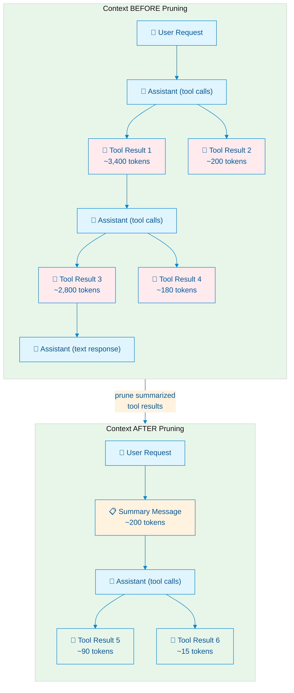
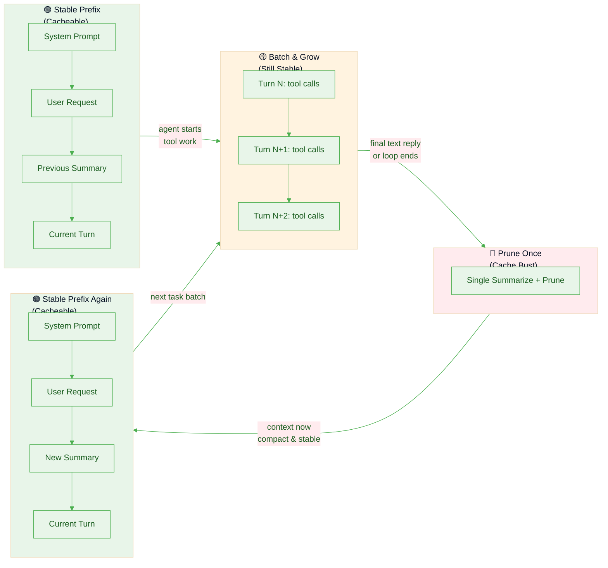

# Understanding Context Pruning in Pi

> How `pi-condense` compresses tool-call history, why it matters for long-running sessions, and how it balances context size against provider-side prefix caching.

---

## Table of Contents

1. [What Does a Long Session Look Like?](#what-does-a-long-session-look-like)
2. [What Pruning Does](#what-pruning-does)
3. [Pruned Data Is Still Available](#pruned-data-is-still-available)
4. [What Actually Lives in the Pruner Index](#what-actually-lives-in-the-pruner-index)
5. [How the Model Re-reads Raw Outputs](#how-the-model-re-reads-raw-outputs)
6. [How Prefix Caching Works](#how-prefix-caching-works)
7. [Why Frequent Pruning Busts Cache](#why-frequent-pruning-busts-cache)
8. [The Sweet Spot: Batch and Prune](#the-sweet-spot-batch-and-prune)
9. [Pre-flush Pipeline & Safeguards](#pre-flush-pipeline--safeguards)
   - [Stub-replace instead of delete](#stub-replace-instead-of-delete)
   - [Protected tools](#protected-tools)
   - [Archival spill compatibility](#archival-spill-compatibility)
   - [Trivial-batch skip (minBatchChars)](#trivial-batch-skip-minbatchchars)
   - [Content-hash dedup](#content-hash-dedup)
   - [Oversized summary rejection](#oversized-summary-rejection)
   - [Frontier persistence](#frontier-persistence)
   - [Other UI / observability features](#other-ui--observability-features)
   - [Token-budget auto-flush trigger](#token-budget-auto-flush-trigger)
   - [Budget-delta flush](#budget-delta-flush)
10. [Chain Compression](#chain-compression)
    - [Protected-output relocation](#protected-output-relocation)
11. [Occurrence Identity](#occurrence-identity)
12. [Error Purge](#error-purge)
13. [Orphan Sweep](#orphan-sweep)
14. [Diagnostics](#diagnostics)
15. [Why Summarization Works: Research Evidence](#why-summarization-works-research-evidence)
    - [SUPO — Summarization augmented Policy Optimization](#supo--summarization-augmented-policy-optimization)
    - [ReSum — Recursive Summarization for Long-Horizon Agents](#resum--recursive-summarization-for-long-horizon-agents)
    - [ACON — Agent Context Optimization](#acon--agent-context-optimization)
16. [Summary](#summary)

---

## What Does a Long Session Look Like?

In Pi, every assistant turn that calls tools produces a sequence of messages in the context tree. In a long coding or research session, this accumulates rapidly:

### ASCII: A typical Pi context tree (before pruning)

```
┌─────────────────────────────────────────────────────────────────────────┐
│  SESSION CONTEXT (growing without bound)                                │
├─────────────────────────────────────────────────────────────────────────┤
│                                                                         │
│  [system]     You are Pi, a helpful coding assistant...                 │
│                                                                         │
│  [user]       Build a React component that fetches data from            │
│               an API and displays it in a table...                      │
│                                                                         │
│  ── Turn 1 ─────────────────────────────────────────                    │
│  [assistant]  <tool_call name="read_file" id="tc-001">                  │
│                 {"path": "src/App.tsx"}                                 │
│  [tool]       export default function App() { ... }        ← 45 tokens  │
│                                                                         │
│  ── Turn 2 ─────────────────────────────────────────                    │
│  [assistant]  <tool_call name="read_file" id="tc-002">                  │
│                 {"path": "package.json"}                                │
│  [tool]       { "dependencies": { "react": "^18.2.0", ... }  ← 120 tok  │
│                                                                         │
│  ── Turn 3 ─────────────────────────────────────────                    │
│  [assistant]  <tool_call name="web_search" id="tc-003">                 │
│               <tool_call name="read_file" id="tc-004">                  │
│  [tool-003]   React Table v7 docs, TanStack Table API...   ← 3,400 tok  │
│  [tool-004]   import { useState } from 'react'; ...        ← 200 tokens │
│                                                                         │
│  ── Turn 4 ─────────────────────────────────────────                    │
│  [assistant]  <tool_call name="edit_file" id="tc-005">                  │
│  [tool]       ✔︎  File updated successfully                 ← 15 tokens  │
│                                                                         │
│  ── Turn 5 ─────────────────────────────────────────                    │
│  [assistant]  <tool_call name="bash" id="tc-006">                       │
│               <tool_call name="read_file" id="tc-007">                  │
│  [tool-006]   BUILD OUTPUT (npm run build):                ← 2,800 tok  │
│               [warn] Circular dependency detected...                    │
│               [warn] Chunk size exceeds 500kb...                        │
│               [error] TypeScript compilation failed...                  │
│  [tool-007]   Updated file contents...                     ← 180 tokens │
│                                                                         │
│  ── Turn 6 ── ... (more turns, more tool calls) ──                      │
│                                                                         │
│  ═══════════════════════════════════════════════════════                │
│  Context size: ~15,000 tokens and growing...                            │
│  Most tokens are raw tool outputs the model already "consumed"          │
│  ═══════════════════════════════════════════════════════                │
│                                                                         │
└─────────────────────────────────────────────────────────────────────────┘
```

In a long session this can grow to **30k–100k+ tokens**. The model pays for every token on every subsequent request. More importantly, the "signal" (what the model actually needs to know) is buried in a mountain of "noise" (full build logs, search results, file contents it already processed).

---

## What Pruning Does

`pi-condense` intercepts completed tool-call batches, summarizes them, and replaces each raw `ToolResultMessage` in future context with a small breadcrumb stub that points at `context_tree_query` for recovery. The original full output is archived in the session index.

### ASCII: The same session *after* pruning Turns 1–5

```
┌─────────────────────────────────────────────────────────────────────────┐
│  SESSION CONTEXT (after pruning Turns 1-5)                              │
├─────────────────────────────────────────────────────────────────────────┤
│                                                                         │
│  [system]     You are Pi, a helpful coding assistant...                 │
│                                                                         │
│  [user]       Build a React component that fetches data from            │
│               an API and displays it in a table...                      │
│                                                                         │
│  [summary]    ╔════════════════════════════════════════════╗            │
│               ║ ⚃  [pruner] Turn 1–5 summary (7 tools)     ║            │
│               ║                                            ║            │
│               ║ • Read existing App.tsx and package.json   ║            │
│               ║ • Searched React Table docs; decided on    ║            │
│               ║   @tanstack/react-table v8                 ║            │
│               ║ • Created DataTable component with         ║            │
│               ║   sorting, pagination, useQuery hook       ║            │
│               ║ • Build failed: circular dependency in     ║            │
│               ║   utils/index.ts → fix by inlining helpers ║            │
│               ║                                            ║            │
│               ║ Summarized tool refs: t1..t7               ║            │
│               ║ Use context_tree_query for raw outputs     ║            │
│               ╚════════════════════════════════════════════╝            │
│               ← ~200 tokens (was ~6,760 tokens)                         │
│                                                                         │
│  ── Turn 6 ─────────────────────────────────────────                    │
│  [assistant]  <tool_call name="read_file" id="tc-008">                  │
│               <tool_call name="edit_file" id="tc-009">                  │
│  [tool-008]   import { helperA } from './helpers'; ...     ← 90 tokens  │
│  [tool-009]   ✔︎  File updated successfully                 ← 15 tokens  │
│                                                                         │
│  ═══════════════════════════════════════════════════════                │
│  Context size: ~500 tokens (plus current turn)                          │
│  ~96% reduction in "stale" context tokens                               │
│  ═══════════════════════════════════════════════════════                │
│                                                                         │
└─────────────────────────────────────────────────────────────────────────┘
```

### Mermaid: The pruning transformation



**Key points:**

- The `AssistantMessage` tool-call blocks are **kept** (they carry the `toolCallId`s the model uses to reference originals via `context_tree_query`).
- `ToolResultMessage` entries for summarized tool calls are **replaced with a small stub** (`[Summarized in pruner summary, ref \`tN\`. Use context_tree_query to retrieve full output.]`) carrying`role: "toolResult"`, the original`toolCallId`/`toolName`/`timestamp`, and`isError: false`. The stub preserves role alternation, so pi-ai's`transformMessages.insertSyntheticToolResults` no longer injects a synthetic `{ isError: true, "No result provided" }` for the (no-longer-)orphaned tool call. See [Stub-replace instead of delete](#stub-replace-instead-of-delete).
- Every pruned tool call is also copied into the pruner's runtime/session index with its `toolCallId`, tool name, args, status, turn index, timestamp, and full `resultText`.
- Ordinary publication is archive-first: persist original records, then call `pi.sendMessage`. An ordinary index entry alone does not permit stubbing or content-hash dedup. Completion comes from observing a summary message with matching occurrence refs. An archive whose delivery failed or was interrupted remains recoverable and capturable, including across a persisted frontier and reload. Existing spill, backfill, chain, and dedup records retain their non-LLM replacement semantics. Repeated archive writes for the same occurrence are skipped; no retry journal or persisted generated-text queue is introduced.
- Every summary uses `pi.sendMessage(..., { triggerTurn: false })`: Pi appends it to live state and persists it once at the completed tool boundary, without starting a turn (requires Pi >=0.84.4). The next request may have snapshotted messages before that delivery drained, so the `context` hook adds missing summaries from `buildContextEntries()` before pruning. Content equality deduplicates live/reloaded summaries; the active-entry boundary prevents resurrection of compacted summaries.
- The session JSONL file retains the original tool-result entries unchanged — pruning only affects what the *next* request sees in active context.
- **Permanent recovery protection:** `context_tree_query` output never enters lossy tool-output summarization or re-stubbing. Chain compression relocates its text verbatim, including for historical chain entries without protection metadata. `recoveryGraceTurns` (default 3) still defers structural chain compression during the grace window; expiry no longer removes verbatim protection. The query tool's explicit response-size limit is unchanged.
  - Recovery calls are excluded at capture and protected again at render for historical records. Recovered text remains in context permanently, so repeated recovery can increase context size.

---

## Pruned Data Is Still Available

Pruning does **not** delete data. It moves raw tool results out of the hot path (active LLM context) and into an indexed archive the model can query later.

There are two separate things happening during pruning:

1. **Context filtering:** future requests stop including the old `toolResult` messages.
2. **Index preservation:** the extension stores each summarized tool call in the pruner index, keyed by its occurrence key (`id@resultTimestamp`, or the bare id for legacy records - see [Occurrence Identity](#occurrence-identity)).

That distinction is the core idea:

- **Pruned from context** does **not** mean **lost**
- It means **hidden from the default prompt**, but still **recoverable on demand**

### ASCII: How `context_tree_query` recovers pruned data

```
┌─────────────────────────────────────────────────────────────────────────┐
│  RECOVERING PRUNED DATA via context_tree_query                          │
├─────────────────────────────────────────────────────────────────────────┤
│                                                                         │
│  [summary]  ... build failed: circular dependency ...                   │
│             - `t1` read config.ts -> 3 exports                          │
│             Summarized tool refs: `t1`                                  │
│             Use `context_tree_query` with these refs                    │
│                                                                         │
│  ── LLM calls context_tree_query({ toolCallIds: ["t1"] }) ──            │
│                                                                         │
│  [tool]     ⌕  context_tree_query result                                │
│             ┌─────────────────────────────────────────────────────┐     │
│             │  Tool: bash (t1)                                    │     │
│             │  Status: OK                                         │     │
│             │  ─────────────────────────────────────────────────  │     │
│             │  $ npm run build                                    │     │
│             │  > react-app@0.1.0 build                            │     │
│             │  > tsc && vite build                                │     │
│             │                                                     │     │
│             │  [warn] Circular dependency: src/utils/index.ts ->  │     │
│             │         src/utils/helpers.ts -> src/utils/index.ts  │     │
│             │  [warn] (!) Some chunks are larger than 500 kBs     │     │
│             │  [error] TS2345: Argument of type 'X' not assignable│     │
│             │          to parameter of type 'Y'...                │     │
│             │                                                     │     │
│             │  [Output truncated: 200/512 lines shown]            │     │
│             └─────────────────────────────────────────────────────┘     │
│                                                                         │
│  The LLM now has the full build log back in context, on demand,         │
│  without permanently inflating the context window.                      │
│                                                                         │
└─────────────────────────────────────────────────────────────────────────┘
```

## What Actually Lives in the Pruner Index

When a batch is summarized, the extension writes a record for each tool call into `ToolCallIndexer` and persists that record into the session as a custom index entry.

Conceptually, each indexed record looks like this (see `ToolCallRecord` in `src/types.ts`):

```ts
{
  toolCallId: "tc-006",
  toolName: "bash",
  args: { command: "npm run build" },
  resultText: "full original raw output...",
  isError: false,
  turnIndex: 5,
  timestamp: 1745251200000 // epoch ms
}
```

This matters because the summary is **not** the only surviving representation of the old tool call.
The model still has access to:

- the original `toolCallId`
- the tool name and arguments
- whether the tool errored
- which turn it came from
- the full original raw result text

So after pruning, the model is working with a **two-layer memory**:

1. **Hot memory:** compact summary text kept directly in context
2. **Cold memory:** full raw tool outputs stored in the pruner index and retrievable by ID

### What is removed vs what is preserved

| Part of old turn | After pruning | Why |
|---|---|---|
| Assistant tool-call block | **Kept in context** | Preserves the `toolCallId` anchors the model uses to reference originals |
| Tool result message | **Replaced by a short stub in active context** | Saves tokens (typical 50–100× reduction per call) while keeping the `toolCallId` anchor and giving the model an explicit `context_tree_query` breadcrumb. The stub keeps `role: "toolResult"` and `isError: false` so role alternation stays intact |
| Summary message | **Added to context** | Gives the model a compact description of what happened |
| Indexed tool-call record | **Stored in pruner index** (`context-prune-index` session entry) | Lets the model re-open the original raw output later via `context_tree_query` |
| Duplicate of an already-indexed record (same toolName + content) | **Aliased to the original; no new summary, no LLM call** (`context-prune-dedup-alias` session entry) | See [Content-hash dedup](#content-hash-dedup) |

## How the Model Re-reads Raw Outputs

The intended recovery flow is:

1. The model reads a summary message.
2. The summary lists the short refs (`t1`, `t2`, …) that were summarized. Each per-tool bullet also carries its own inline `` `tN` `` ref (copied from a `[[N:toolname]]` label the summarizer emits, validated against the tool at that position), so the model can jump from a bullet straight to its ref; the flat footer still lists every ref as a fallback.
3. The model decides the summary is not enough and wants exact raw output.
4. The model calls `context_tree_query({ toolCallIds: ["t1", ...] })`. The tool accepts short refs and full `toolCallId`s interchangeably (`indexer.resolveToolCallId`).
5. The tool looks up those IDs in the pruner index.
6. The tool returns the original stored output back into the current turn.
7. The model can now inspect that raw result and continue reasoning.

### ASCII: end-to-end "prune, then re-read" flow

```text
assistant turn with tools
        │
        ▼
raw tool results exist in context
        │
        ▼
batch gets summarized
        │
        ├─► summary message added to context
        │      └─► includes short refs (`t1`, `t2`, …)
        │
        ├─► tool results indexed by occurrence key (id@resultTimestamp)
        │      └─► full raw resultText stored in index/session
        │
        └─► old toolResult messages removed from future context

later...
        │
        ▼
model sees summary and decides: "I need the exact old output"
        │
        ▼
context_tree_query({ toolCallIds: ["t1"] })
        │
        ▼
query tool resolves short ref / id and loads the indexed record
        │
        ▼
original raw output is returned into the current turn
        │
        ▼
model continues with exact old context back in view
```

### Why this is important

- summaries keep the default context small
- short refs / `toolCallId`s keep old work addressable
- `context_tree_query` makes the archive readable again
- the model can "page in" exact old context only when it actually needs it

Summaries are the default view; raw data remains addressable through `context_tree_query`.

---

## How Prefix Caching Works

Modern LLM API providers (Anthropic, OpenAI, vLLM, etc.) implement **prefix caching** (also called "prompt caching") to speed up repeated requests with similar prompts.

### How it works

LLM inference has two phases:

1. **Prefill** — compute Key-Value (KV) attention states for all input tokens
2. **Decode** — generate output tokens autoregressively, reusing the cached KV states

Prefix caching stores the KV states for an exact token sequence on the provider's GPU. When a new request shares an identical prefix, the provider **skips prefill** for that prefix and starts from the cached KV state.

### ASCII: Cache hit vs cache miss

```
┌─────────────────────────────────────────────────────────────────────────┐
│                    WITHOUT PREFIX CACHING                               │
├─────────────────────────────────────────────────────────────────────────┤
│                                                                         │
│  Request 1:  [System] [User Q1] ──► LLM computes KV for ALL tokens      │
│                                        │                                │
│                                        ▼                                │
│                                   Generate answer                       │
│                                                                         │
│  Request 2:  [System] [User Q2] ──► LLM computes KV for ALL tokens      │
│              ▲▲▲▲▲▲▲▲▲▲▲▲▲▲▲▲▲         │ (EVERYTHING recomputed)        │
│              Same prefix as Request 1  ▼                               │
│                                   Generate answer                       │
│                                                                         │
│  Time:  ████████████████████████████████████████  ~2.5s each            │
│  Cost:  Full input tokens priced at standard rate                       │
│                                                                         │
└─────────────────────────────────────────────────────────────────────────┘

┌─────────────────────────────────────────────────────────────────────────┐
│                    WITH PREFIX CACHING (HIT)                            │
├─────────────────────────────────────────────────────────────────────────┤
│                                                                         │
│  Request 1:  [System] [User Q1] ──► LLM computes KV for ALL tokens      │
│                                        │                                │
│                    ┌───────────────────┘                                │
│                    ▼                                                    │
│              [STORED IN CACHE]                                          │
│                                                                         │
│  Request 2:  [System] [User Q2] ──► SKIP! KV loaded from cache          │
│              ▲▲▲▲▲▲▲▲▲▲▲▲▲▲▲▲▲         │ (prefix match = instant)       │
│              Cache hit!                ▼                                │
│                                   Only compute NEW tokens               │
│                                   Generate answer                       │
│                                                                         │
│  Time:  ████████████████████░░░░░░░░░░░░░░░░░░░  ~0.5s (80% faster)     │
│  Cost:  Cached prefix at 50-90% discount (provider-dependent)           │
│                                                                         │
└─────────────────────────────────────────────────────────────────────────┘
```

### Provider specifics

| Provider | Cache Activation | Match Type | Duration |
|---|---|---|---|
| **Anthropic** | Manual — `cache_control: {type: "ephemeral"}` on message blocks | Exact prefix from breakpoints | Tied to usage pattern |
| **OpenAI** | Automatic for prompts ≥1,024 tokens | Exact prefix match; ~first 256 tokens hashed for routing | 5–10 min inactivity (up to 1 hr) |
| **vLLM / Self-hosted** | Automatic via hash-based block matching | Exact block match | Instance lifetime |

### Critical rule

> **Cache matching requires *exact* token sequences.** Any change — reordering messages, editing text, adding/removing tool results, even whitespace — alters the prefix hash and triggers a **cache miss**.

---

## Why Frequent Pruning Busts Cache

Every time you prune, you **rewrite the prefix**. The message that was previously a 3,400-token tool result is now a 200-token summary. That's a different token sequence, so the cache is invalidated.

### ASCII: The per-turn pruning trap (naive per-turn pruning)

```
┌─────────────────────────────────────────────────────────────────────────┐
│  NAIVE PER-TURN PRUNING — AGGRESSIVE BUT CACHE-UNFRIENDLY               │
├─────────────────────────────────────────────────────────────────────────┤
│                                                                         │
│  Turn 1:  Read file → 45 tokens                                         │
│           └──► summarize → inject summary                               │
│           │                                                             │
│           └──► CACHE BUST: context changed from [toolResult] to [sum]   │
│                                                                         │
│  Turn 2:  Read package.json → 120 tokens                                │
│           └──► summarize → inject summary                               │
│           │                                                             │
│           └──► CACHE BUST again: prefix rewritten AGAIN                 │
│                                                                         │
│  Turn 3:  Web search + read file → 3,600 tokens                         │
│           └──► summarize → inject summary                               │
│           │                                                             │
│           └──► CACHE BUST again: prefix rewritten AGAIN                 │
│                                                                         │
│  After 5 turns:                                                         │
│    • 5 summarizer LLM calls (latency + cost)                            │
│    • 5 cache busts (FULL prefill every time)                            │
│    • No prefix ever stayed stable long enough to benefit from caching   │
│                                                                         │
│  Time:  ████████████████░░░░░░  ~80% spent on re-computing prefixes     │
│                                                                         │
└─────────────────────────────────────────────────────────────────────────┘
```

---

## The Sweet Spot: Batch and Prune

The insight is simple: **batch many tool turns, then prune once**. Everything before the prune point stays in the prefix cache and remains cacheable. Only the new suffix (since the last prune) needs fresh computation.

### ASCII: Batch pruning (`agent-message` mode)

```
┌─────────────────────────────────────────────────────────────────────────┐
│  agent-message MODE — BATCH THEN PRUNE (RECOMMENDED)                    │
├─────────────────────────────────────────────────────────────────────────┤
│                                                                         │
│  ┌─────────────────────────────────────────────────────────────────┐    │
│  │  BATCH PHASE: Tool turns accumulate (not pruned yet)            │    │
│  │                                                                 │    │
│  │  Turn 1: Read file → 45 tokens   ═══════╗                       │    │
│  │  Turn 2: Read package → 120 tokens  ════╬══════╗                │    │
│  │  Turn 3: Web search + read → 3,600 tok  ═════╬═╬═════╗          │    │
│  │  Turn 4: Edit file → 15 tokens    ═══════╬═╬═╬═╬════╬═════╗     │    │
│  │  Turn 5: Build + read → 2,980 tokens    ═╬═╬═╬═╬════╬═════╬═╗   │    │
│  │  Turn 6: Read + edit → 105 tokens   ═════╬═╬═╬═╬════╬═════╬═╬   │    │
│  │                                       ▼ ▼ ▼ ▼   ▼     ▼   ▼ ▼   │    │
│  │  All these tool results stay in context UNCHANGED               │    │
│  │  → Prefix cache is STABLE → cache HITS on every turn            │    │
│  └─────────────────────────────────────────────────────────────────┘    │
│                                    │                                    │
│                                    │ Agent sends final text reply       │
│                                    ▼                                    │
│  ┌─────────────────────────────────────────────────────────────────┐    │
│  │  PRUNE PHASE: Single summary replaces batch                     │    │
│  │                                                                 │    │
│  │  [summary] "Built React table component. Key decisions:..."     │    │
│  │                                                                 │    │
│  │  ONE cache bust, then context is STABLE again                   │    │
│  └─────────────────────────────────────────────────────────────────┘    │
│                                    │                                    │
│  ┌─────────────────────────────────────────────────────────────────┐    │
│  │  STABLE PHASE: New requests reuse cached prefix                 │    │
│  │                                                                 │    │
│  │  User: "Now add sorting"                                        │    │
│  │  → Cache HIT on [system] + [user] + [summary] prefix            │    │
│  │  → Only "Now add sorting" needs prefill                         │    │
│  │  → Fast + cheap                                                 │    │
│  └─────────────────────────────────────────────────────────────────┘    │
│                                                                         │
│  Result: 1 cache bust per meaningful work unit, not per turn            │
│                                                                         │
└─────────────────────────────────────────────────────────────────────────┘
```

### Mermaid: Cache-friendly pruning lifecycle



### Cache impact trade-off

| Mode | Cache Busts per 5 Turns | Context Reclaimed | Recommended for |
|---|---|---|---|
| `agent-message` | 1 | After batch | **Default** — best balance |
| `on-demand` | 0–1 | When you say so | Maximum cache preservation |

> **Everything before the previous pruning point stays in the prefix cache.** The cached prefix is the stable foundation; only the new suffix (recent turns since last prune) changes per request.

---

## Pre-flush Pipeline & Safeguards

`flushPending` filters protected and unsupported non-text results, deduplicates completed outputs, and skips trivial batches before calling the summarizer. Only completed summaries, deduplication and trivial skips advance the frontier. Failed, length-truncated, estimated-over-budget or oversized summaries retain originals and leave the rejected batch pending.

```
captured batches (from turn_end or session scan)
  │
  ├─ 1. Protected-tools/paths filter   (capture-time, see below)
  │     newest read per protected path stays verbatim; older reads of the same
  │     path are stubbed at render time once the cache is cold anyway (see § Supersession)
  │     tool calls whose toolName is in protectedTools, OR whose args.path
  │     matches any protectedPaths glob, never enter the batch
  │
  ├─ 2. Recovery/non-text exclusion
  │     context_tree_query and results containing non-text blocks stay verbatim;
  │     no eager spill or replacement with a preview
  │
  ├─ 3. Frontier trim                 (drop tool calls already past the frontier)
  │
  ├─ 4. Content-hash dedup            (config: dedupByContentHash, default ON)
  │     identical (toolName, normalize(resultText)) → alias of original;
  │     no LLM call; persist as context-prune-dedup-alias
  │
  ├─ 5. Trivial-batch skip            (config: minBatchChars, default 1000)
  │     batches whose remaining raw chars < threshold → skip; no LLM call;
  │     leave originals in context; advance frontier
  │
  ├─ 6. Summarizer LLM call           (parallel: one call per batch)
  │     resolveModel + summarizeBatch / summarizeBatches
  │
  └─ 7. Oversized post-check          (decorated summary > raw? retain; no frontier advance)
```

New frontier outcomes are `summarized`, `skipped-deduped`, or `skipped-trivial`. Historical `skipped-oversized` entries remain readable. The summarizer receives all captured text. Pi's context-token estimate rejects inputs already at or above the selected model's `contextWindow`; Pi clamps the output budget, and provider rejection or length-limited output also fails open. The estimate is not exact tokenization.

### Stub-replace instead of delete

Before v0.11.0 the pruner deleted summarized `ToolResultMessage` entries outright. This worked, but it left the matching `AssistantMessage.toolCall` blocks orphaned, and pi-ai's `transformMessages.insertSyntheticToolResults` would inject `{ isError: true, content: "No result provided" }` for every orphan at LLM call time. The model then saw a parade of fake "tool errors" before the unrelated summary user-message appeared later, which mildly confused larger reasoning models.

The pruner now keeps the toolResult message but replaces its content with a small stub:

```
[Summarized in pruner summary, ref `tN`. Use context_tree_query to retrieve full output.]
```

Properties:

- `role: "toolResult"` and the original `toolCallId` / `toolName` / `timestamp` are preserved — role alternation is intact; no synthetic-result injection.
- `isError: false`, so the model does not interpret the stub as a tool failure.
- The stub references the **short ref** (`t1`, `t2`, …) the indexer assigned at summary time. Legacy entries from before short-refs landed fall back to the raw `toolCallId`.
- Deterministic per occurrence key — the stub text never changes across renders of the same `toolResult`, so the prefix cache continues to hit on the pruned range. A reused `toolCallId` is a *different* occurrence (different `resultTimestamp`) and gets its own stub and its own short ref.

Implementation: `src/pruner.ts` `pruneMessages(messages, indexer)` returns `{ messages, pruned }`. When `pruned === false`, the original array reference is returned and the `context` handler skips reconstruction entirely.

### Protected tools & paths

A tool call is protected if **either** its `toolName` is in `protectedTools` **or** its `args.path` (string) matches any glob in `protectedPaths`. Protected calls are filtered out **at capture time** - they never enter the `pendingBatches` queue, so their raw `ToolResultMessage` stays verbatim in future LLM context unless a later successful read of the same path contains identical text-only output (below).

**`protectedTools: string[]`** (default `[]`) - allowlist of tool names. Covers tools whose output is a small handle that must be reused byte-for-byte (e.g. a session-id) or planning tools like `todowrite` / `todoread`.

**`protectedPaths: string[]`** (default `["**/skills/**/*.md", "**/gauntlet-overrides.md"]`) - glob list matched against `args.path`. Designed for skill files that carry multi-step workflow gates; summarizing them is categorically lossy. Non-string or missing `path` arguments never match. Set `[]` to disable. Edit with `/pruner protected-paths`.

Glob contract: full-path match against the raw `args.path` string with `\` normalized to `/`. `*` and `?` match within a segment (no `/`); `**` crosses segments; `**/` also matches zero directories (so `**/SKILL.md` matches a bare relative `SKILL.md`). Case-sensitive. All other characters are regex-escaped literals.

**Render-time re-check:** stub replacement runs in-flight on every turn (`pruneMessages`). If a tool call's persisted `args` now satisfy `isProtected` (e.g. a pattern was added mid-session), the stub is skipped and the raw result is left verbatim - this repairs already-summarized records in existing sessions with no schema change. Declared limitation: records inside already-compressed chains (`context-prune-chain` entries) are NOT repaired - their `protectedToolCallIds` set is fixed at compression time (forward-only). Dedup-alias edge: an alias resolving to an unprotected original stays stubbed.

**Supersession (phase 1b, `src/supersede.ts`):** protected calls are never indexed, so content-hash dedup never sees them. At render time, successful protected `read` results are grouped by normalized `args.path` (backslash -> slash) and their complete text-only `content` array. Only earlier **identical** results may become the one-line stub `[Superseded: <path> was read again later in this conversation - see the newer read. Re-read the file if this earlier content is needed.]`. The stub keeps `toolCallId`/`toolName`/`timestamp`, so pi-ai's orphan repair never fires; the assistant `toolCall` block is untouched. Failed reads, nontext results, other tools, and calls without a paired result never participate. Distinct pages, partial reads, and changed file contents stay verbatim: neither equal paths nor equal `offset`/`limit` arguments prove replacement coverage. Even a read without pagination arguments can be truncated by Pi. Exact content equality avoids guessing about file versions or intervals; continuation notices and text-block boundaries must also match. Recovery is "re-read the file" - no `t<N>` ref. Provider tool-call ids repeat across turns and an aborted call has no result, so a result is paired only with the same-id call in the immediately preceding assistant message (the per-turn open-set model orphan-sweep uses) - never by a global per-id cursor.

**Cadence (prompt-cache economics):** a superseded read is stubbed only when the pruner is already rewriting at or before its position - `floor` is the earliest result timestamp phase 1 will stub on the next render (indexed batches, plus dedup aliases registered in the pre-flush pass - those are stubbed by phase 1 whatever their batch's outcome; a `skipped-trivial`/`skipped-oversized` batch's own calls set none) or the `startUserTimestamp` of a chain compressed this turn - or on a guaranteed-cold event: `session_start`, `session_tree`, `model_select`, `session_compact`, `thinking_level_select` (`floor = 0`, activate all). Activation is session-sticky (in-memory `occKey` set, cleared on `session_start`/`session_tree`); between those moments a freshly superseded copy stays verbatim on purpose, since a mid-prefix rewrite re-bills the whole tail once. `isProtected` is evaluated live, so a path that stops matching `protectedPaths` drops out of supersession and rejoins the normal pipeline. No config key: supersession is on whenever protection is. Candidate identity: `doc/specs/2026-09-09-protected-read-evidence.md`. Cache cadence: `doc/specs/2026-09-07-protected-path-supersede.md`.

Names and patterns that don't match any captured tool call are silently ignored.

### Archival spill compatibility

New tool results are no longer eagerly spilled and replaced by previews before summarization. Large text follows the full-input summary path; rejection leaves it inline.

`spillThreshold` (default `65536`) and `spillPreviewBytes` still control sidecar storage when backfilling missing archives for summary-covered chains. Historical spilled records remain readable. Sidecars use `<sessionDir>/<sessionId>-blobs/<first 234 sanitized characters>.<16-hex sha1 of the occurrence key>.txt`, capped at 255 filename bytes.

Keep the session's `-blobs/` directory when moving its JSONL. Without it, historical spilled bodies cannot be recovered; only the stored head preview remains.

### Trivial-batch skip (minBatchChars)

`minBatchChars: number` (default `1000`) is a pre-flush guard against "summary would be roughly the same size as the input" cases. If the total raw `resultText` across a batch is below the threshold, the batch is skipped: no summarizer LLM call, no `context-prune-index` entry, no `context-prune-summary` injection. The frontier still advances, so the same tool calls are not reconsidered next flush.

Why it exists: a short LLM summary like "Tool X did Y" is itself ~50–150 chars per call. For a 200-byte file read or an `ls` of a short directory, the summary is the same size or larger than the input — the post-call oversized rejection would catch it anyway, but only after the LLM round-trip and the cost. `minBatchChars` short-circuits the obvious cases at zero LLM cost.

Set `minBatchChars: 0` to disable. The default `1000` skips obvious trivial batches (`git status`, small file reads, short directory listings) without affecting realistic tool outputs. Edit with `/pruner min-batch-chars <n>` or via the settings overlay.

### Content-hash dedup

`dedupByContentHash: boolean` (default `true`) catches re-reads of already-pruned tool outputs at zero LLM cost.

Mechanism:

1. When a batch enters `flushPending`, each tool call is hashed by `SHA-1(toolName + "\0" + normalize(resultText))`.
2. The indexer's `contentHashToOriginal` map (populated by every earlier `addBatch` / `reconstructFromSession`) is consulted.
3. A hit means an earlier prune already covered identical content. The duplicate is registered as an alias of the original via `indexer.registerDuplicate(newKey, originalKey, appendEntry)`, where both are occurrence keys (or legacy bare ids):
   - `dedupAliasToOriginal[newKey] = originalKey` (so `isSummarized(newKey) === true` and `resolveToolCallId(newKey) === originalKey`).
   - `toolCallIdToAlias[newKey] = toolCallIdToAlias[originalKey]` (so `getShortRefForToolCallId(newKey)` returns the **same** `tN` as the original).
   - Keying by occurrence key, not bare id, means a duplicate is only ever aliased to the specific earlier *occurrence* it matches byte-for-byte - a reused id whose later occurrence has different content is not conflated with the stale one.
   - A `context-prune-dedup-alias` custom entry is persisted so `reconstructFromSession` rebuilds the maps after a restart.
4. The duplicate is removed from the batch — no summarizer call, no new index entry.
5. Later, `pruneMessages` stub-replaces the duplicate's `ToolResultMessage` using the original's short ref, and `context_tree_query` returns the original's record whether the model passes the duplicate's id or the original's.

Normalization is conservative: `\r\n` → `\n`, per-line trailing whitespace stripping, final `trim()`. Internal whitespace, tabs, and capitalization are preserved so two genuinely different outputs do **not** collide.

Typical wins: re-reading an unchanged file, repeated `git status` / `ls`, retries of the same command. v1 only matches against records **already in the indexer** (cross-flush dedup); intra-flush dedup is deferred so canonicals that get skipped as oversized / trivial never produce dangling aliases.

Edit with `/pruner dedup on|off|status` or the settings overlay.

### Oversized summary rejection

Last-resort safeguard: if the summarizer LLM produces a summary longer than the raw tool-result text it would replace, the batch is left untouched — the original tool results stay in context, no summary is injected, the batch stays pending, and the frontier does not advance. The call's usage is still recorded in `context-prune-stats` and `cost:external`, and a warning is always shown; `quietOversizedSkips` silences only trivial/dedup info notifications. After rejection the batch is handled like a failed or length-truncated summary (see [Pre-flush Pipeline & Safeguards](#pre-flush-pipeline--safeguards)).

This is rare in practice once `minBatchChars` is on, because the cases where summarization makes things bigger are exactly the cases the trivial-batch skip already catches earlier. A batch rejected again on the next flush is charged again; there is no rejection backoff.

### Frontier persistence

The last completed prune boundary is persisted as `context-prune-frontier` so `flushPending` knows where the previous flush left off, even if that flush only skipped trivial or deduplicated batches. Rejected summaries leave the frontier in place, so their batches are re-attempted on the next flush instead of being lost.

### Other UI / observability features

- **Tree browser (`/pruner tree`):** interactive, foldable tree of pruned tool calls grouped under their summaries. `Ctrl-O` on a summary node opens the full markdown summary in a bordered overlay.
- **Configurable summarizer thinking (`summarizerThinking`):** trade summary cost / latency for quality (`off` / `minimal` / `low` / `medium` / `high` / `xhigh`). `default` omits the option entirely so the provider chooses.
- **Cumulative stats:** `context-prune-stats` entries track input/output tokens and cost of every summarizer call; full detail surfaces in `/pruner stats`. Cost is also emitted on the `cost:external` pi.events channel for external aggregators (cumulative per session, live only).
- **Footer status:** enabled indicator only; see [configuration reference](doc/configuration.md#footer-status-widget).
- **Live progress for `/pruner now`:** an `aboveEditor` widget shows one row per pending batch with braille spinner, streamed summary-char count, and ✓ / ⚠ status.

### Summarizer outage fallback

Provider incidents are routinely per-model: a cheap summarizer model (e.g.
Haiku) can be down while the session's main model (Sonnet/Opus) stays healthy.
Without a fallback, `runSummarization` returns `null`, the batch is re-queued,
and the next flush retries the same dead model — pruning stalls for the whole
outage and context grows unbounded.

`src/summarizer-fallback.ts` adds a sticky, in-memory `FallbackController` that
engages only on **transient** failures of the configured summarizer model and
only when a distinct fallback model exists (`summarizerModel` != `default` and
the resolved model differs from `ctx.model`):

- **Classification is coarse** (pi-ai surfaces no status code on the throw):
  `auth` (pre-flight key failure) and `unusable` (empty / length-truncated)
  never trip the controller; a `transient` stream error / `stopReason: error`
  does. Aborts propagate unchanged.
- **Enter:** retry initial transient primary failures up to 3 times (4 primary
  attempts total), waiting 3s, 9s, then 27s before the three retries (27s maximum).
  The initial attempt is immediate. Stop early on success, auth failure, or
  unusable output. After exhaustion, attempt the current session model once
  immediately, without another delay. Primary attempts
  keep configured reasoning; fallback omits reasoning options (provider default,
  not session-selected reasoning). If fallback succeeds, the controller becomes
  sticky and a one-time warning fires. If it fails, stop this call and retain
  pending work for later triggers; the session is not paused.
- **Attempt scope:** idle and maximum timeouts apply separately to each attempt,
  not to retry waits. Cancellation interrupts waits and prevents subsequent
  attempts. Same-model and no-controller calls
  retain their single-attempt behavior.
- **Sticky + probe:** while in fallback, all calls route to the session model.
  After a 3-minute cooldown (`COOLDOWN_MS`, internal, not configurable) one
  batch of the next flush probes the primary once, without the 3 retries;
  success recovers (info notify), transient failure gets one fallback attempt.
  During cooldown, each call gets just one fallback attempt.
- **In-memory only:** no `context-prune-*` entry; `reset()` on `session_start`.
  A restart mid-outage re-detects on the next flush.

Cost note: the initial detection flush can fire up to 4N doomed primary attempts
for N concurrent batches
before the outage is known; steady state is 0 doomed calls, plus at most 1
probe per 3 minutes. Probing is on demand: after the cooldown, the next
summarization call tests the primary. A successful probe switches back from
the (often pricier) session model.

---

## Why Summarization Works: Research Evidence

Summarizing tool-call history is not just a hack — it is an active research area with strong empirical support. Three recent papers establish the benefits:

---

### SUPO — Summarization augmented Policy Optimization

> **Paper:** *SUPO (arXiv:2510.06727)* — Miao Lu et al.  
> **TL;DR:** RL-trained agents with built-in summarization outperform standard agents on long-horizon tasks while using *less* context.

**Core idea:**
SUPO integrates summarization directly into the RL training pipeline for tool-using agents. Instead of treating context compression as an afterthought, the policy gradient is derived to optimize **both** tool-use behavior **and** summarization strategy end-to-end.

**Method:**

- Periodically compresses tool-using history via LLM-generated summaries
- Retains task-relevant information in compact form
- Derives a policy gradient that lets standard LLM RL infrastructure optimize both behaviors simultaneously
- Enables training beyond fixed context limits

**Key results:**

- Significantly improved success rate on interactive function calling and search tasks
- **Same or lower working context length** compared to baselines that don't summarize
- Test-time scaling: increasing the maximum summarization rounds during evaluation further improves performance

**Why this matters for Pi:**
SUPO proves that summarization is not just about saving tokens — it actively **improves task success** on long-horizon multi-turn problems by preventing context overflow and keeping relevant signals prominent.

---

### ReSum — Recursive Summarization for Long-Horizon Agents

> **Paper:** *ReSum (arXiv:2509.13313)* — Xixi Wu et al. (Alibaba)  
> **TL;DR:** A plug-and-play summarization tool enables web agents to explore indefinitely without hitting context limits, achieving 4.5–12.7% gains over ReAct.

**Core idea:**
ReSum addresses the fundamental conflict between **exploration** (needing many tool calls) and **context limits** (fixed window size). Current agents append every thought/action/observation to history until they crash into the context ceiling.

**Method:**

- Periodically invokes an external **summary tool** to condense interaction history
- The agent restarts reasoning from the compressed summary
- Introduces **ReSum-GRPO**: adapts Group Relative Policy Optimization with **advantage broadcasting** — propagates final trajectory rewards across all segments so early exploration steps get proper credit
- Trained a specialized **ReSumTool-30B** to extract key evidence and propose next steps

**Key results:**

- **4.5% improvement** over ReAct in training-free settings
- **Further 8.2% gain** with ReSum-GRPO training
- A 30B ReSum-enhanced agent with only 1K training samples achieves competitive performance with leading open-source models
- Enables "unbounded exploration" — the agent never hits a hard context wall

**Why this matters for Pi:**
ReSum validates the exact architecture `pi-condense` uses: an external summarizer module, periodic compression, and recovery from compressed state. The plug-and-play nature means it works with off-the-shelf agents — no retraining required.

---

### ACON — Agent Context Optimization

> **Paper:** *ACON (arXiv:2510.00615)* — Minki Kang et al. (Microsoft/ KAIST)  
> **TL;DR:** Optimized compression guidelines reduce memory by 26–54% while preserving accuracy; distilled compressors retain >95% of performance.

**Core idea:**
ACON is a unified framework that compresses **both** environment observations and interaction histories into "concise yet informative condensations." It treats compression as an optimization problem: maximize task reward while minimizing context cost.

**Method:**

- **Gradient-free** — uses natural language space optimization (no model fine-tuning)
- **Failure-driven guideline optimization:** runs the agent with and without compression, collects cases where compression caused failure, and uses an optimizer LLM to refine compression guidelines
- Two-step alternation:
  1. **Utility maximization** — ensure task success is preserved
  2. **Compression maximization** — make summaries shorter while keeping sufficiency
- **Distillation:** optimized compressor can be distilled into smaller models (e.g., Qwen-14B) with >95% accuracy retention

**Key results:**

- **26–54% reduction in peak tokens** across AppWorld, OfficeBench, and Multi-objective QA
- Preserves task performance with large models
- **Smaller LMs improve 20–46%** as agents when context compression removes distracting noise
- Distilled compressor retains **>95% accuracy**

**Why this matters for Pi:**
ACON demonstrates that **compression not only saves tokens but can improve agent performance** — especially for smaller models, where long noisy context actively degrades reasoning quality. The failure-driven optimization approach shows that even simple summarization, when guided by task structure, preserves critical signals.

### Token-budget auto-flush trigger

`autoBudgetThreshold` (default `null`) is an ADDITIONAL flush trigger orthogonal to `pruneOn`. When set to a fraction in `(0, 1]`, the extension evaluates context usage at the end of every tool-using turn; when `tokens` reaches `min(MAX_BUDGET_WINDOW, threshold * contextWindow)` - i.e. the configured share of the model's window, or 300,000 tokens, whichever comes first - all pending batches are flushed immediately regardless of the configured `pruneOn` mode.

**Why we compute this ourselves rather than using `ContextUsage.percent`:** the provider's `percent` field is a 0-100 value, and both it and `tokens` are `null` immediately after a provider-side compaction. Comparing `tokens` against a token level we derive ourselves keeps the unit unambiguous and is independently null-safe - a `null` tokens value makes the trigger a no-op until usage is reported again. Note this trigger never divides: the fraction form (`tokens / min(contextWindow, MAX_BUDGET_WINDOW)`) belongs to `usageFraction` and the delta trigger below, and reading the threshold as a share of a capped window would be wrong - on a 1M-window model, `0.4` fires at 300,000 tokens, not at 120,000.

**Why the 300k ceiling (`MAX_BUDGET_WINDOW`, `src/budget.ts`):** the trigger was originally a pure fraction of the advertised window, which made it unreachable as windows grew. On a 1M-window model, `0.9` means 900k tokens - a session ends long before that, so users observed "pruning never happens" (issue #7), while the same setting worked on a 200k model. The ceiling is deliberately chosen so it never binds at or below a 300k advertised window (a 256k model at `0.9` still fires at 230.4k), so it changes behavior only where the fraction was already unusable. Users keep full downward control: `0.1` on a 1M model still means 100k tokens.

Lineage: simplified take on DCP's `maxContextLimit` nudging — a single threshold that forces a flush rather than separate nudge/force thresholds.

### Budget-delta flush

`budgetTurnDelta: number | null` (default `null`) is a per-turn usage-jump trigger ORed with `autoBudgetThreshold`. When set to a fraction in `(0, 1]`, the extension compares the current turn's usage fraction (`tokens / min(contextWindow, MAX_BUDGET_WINDOW)`) to the previous turn's and forces a flush if the jump meets or exceeds the delta. Because the denominator carries the same 300k ceiling, the required growth is `delta * min(contextWindow, MAX_BUDGET_WINDOW)` tokens: `0.1` = +30k on any model at or above 300k, +20k on a 200k model. The ceiling enters through the denominator here rather than bounding a level, because a 300k ceiling on one turn's growth could never bind. Note the fraction is therefore not bounded by 1 above the ceiling (600k tokens on a 1M window = 2.0) and is deliberately not clamped - clamping would saturate this trigger and stop it re-arming.

Use case: a single enormous tool result can jump context usage by 20–30 percentage points in one turn; `autoBudgetThreshold` misses this until the next turn. `budgetTurnDelta` catches the spike immediately.

**`previousFraction` tracking:**

- Reset to `null` on `session_start` and `session_tree` (session reload).
- Left unchanged on a null-tokens turn immediately following a provider-side compaction (treating a post-compaction null as `0` would produce a spurious spike on the next real turn).
- The post-restart first turn cannot fire a delta trigger (no prior fraction to compare) and falls back to `autoBudgetThreshold` alone.

`null` = off (default).

### Frontier-gap flush trigger

`frontierGapThresholdTokens: number | null` (default `null`) is a third flush trigger, ORed with `autoBudgetThreshold` and `budgetTurnDelta` at `turn_end` (precedence within that handler: budget, then delta, then frontier-gap - only the first that fires flushes that turn). Unlike the other two, which measure a *fraction* of the context window, this one is an absolute token count against `frontierGapTokens` (the un-pruned tail past the persisted prune frontier, same metric as `/pruner status` and `computeContextMetrics`). Rationale: a window-fraction trigger becomes unreachable on a large enough advertised window (the same problem `MAX_BUDGET_WINDOW` addresses for the level form) long before the un-pruned tail is actually a problem in tokens - this trigger is the absolute-token complement, independent of window size.

It only evaluates at `turn_end`, same call site as the other two triggers, and is self-throttling: `frontierGapTokens` is measured against the persisted prune frontier, which advances on every processed flush outcome (summarized and skipped-* alike, including one this trigger itself causes) - an attempt that finds zero capturable batches does not advance it, and rewrites nothing, so it cannot churn the cache - so under normal operation it cannot fire again until the un-pruned tail regrows by another threshold-worth of tokens; on a mid-flush summarizer failure the frontier advances only to the persisted prefix, so the next gated turn may re-fire while consuming the remaining backlog, making the bound amortized (one extra prefix rewrite per threshold-worth of new tail growth) rather than per-turn-exact under failures. Recommended starting value `80000` - well above the ~5k-15k tokens a session typically accumulates per flush, so it only fires when flushes stop happening for an unusually long stretch (e.g. a long auto-continued run). Config-file-only - no `/pruner settings` row.

`null` = off (default).

---

## Chain Compression

Chain compression is a second layer on top of the per-batch tool-result stub pruner. It operates on entire closed conversation chains rather than individual tool results, reclaiming the tokens that the stub pruner cannot touch: assistant thinking blocks, encrypted thinking signatures, and tool-call argument bodies.

### What a closed chain is

A **closed chain** is a span of messages from one user message - or a non-pruner custom message (`role: "custom"` with a `customType` not prefixed `context-prune-`), the latter only accepted as a chain start while the chain detector is idle (mid-chain, a non-pruner custom is passthrough, not a new anchor) - through any number of tool-using assistant turns and their results, ending in a final text-only assistant reply:

```
[user msg]                         ← chain start (kept raw)
[assistant: thinking + toolCalls]  ← middle (dropped)
[toolResult]                       ← middle (dropped)
[assistant: thinking + toolCalls]  ← middle (dropped)
[toolResult]                       ← middle (dropped)
[assistant: text-only]             ← chain close (kept, thinking stripped)
```

### What gets dropped vs. kept

| Part | After chain compression |
|---|---|
| Start user message (or idle-anchored custom message) | **Kept raw** |
| Middle assistant turns (all) | **Dropped** — assistant thinking + signatures + toolCall argument blocks |
| Middle tool results (all) | **Dropped** — already stub-replaced by the per-batch pruner; now fully removed |
| Per-batch summary message(s) for this chain | **Suppressed** — replaced by the chain-level synthetic |
| Final text-only assistant | **Kept**, thinking blocks stripped (safe — no following tool cycle depends on the signature) |
| Synthetic `<compressed-chain>` user message | **Injected** immediately after the start user message |

**Why there is no separate thinking strip.** The synthetic `<compressed-chain>` block is injected as a `role: "user"` text message, which Anthropic reads as a genuine user turn. That closes the assistant cycle, and the API drops every prior thinking block from the context window server-side - verified against the live API: the same 8-turn loop bills 3152 thinking tokens with a full `toolResult` history and 0 once a user text block precedes the final assistant. So chain compression already reclaims thinking mass for free, as a side effect of the range drop that was rewriting that region anyway. Stub replacement does not have this effect: it preserves `role: "toolResult"`, so the cycle stays open. A dedicated strip phase shipped through v2.4.3; removed in v2.5.0 - see `doc/specs/2026-08-05-remove-thinking-strip.md`.

### Transform composition order

```
raw messages from session
  │
  ├─ [1] tool-result stub-replace   (per-batch; existing)
  ├─ [1b] supersede                (older identical successful protected text reads -> stub; see § Supersession)
  ├─ [2] error-purge                (phase 2)
  ├─ [3] chain-range-prune          (runs AFTER stubs)
  │        resolve each entry to a positional index range
  │        drop assistant / toolResult / per-batch-summary inside the range
  │        inject <compressed-chain> after start user
  │        strip thinking from final assistant
  └─ [4] orphan sweep               (structural post-condition, see below)
```

### Identification model: positional ranges, not ids

Pi-ai's `Message` union (`UserMessage | AssistantMessage | ToolResultMessage`) has no `.id` field, and provider `toolCallId`s are not session-durable (see [Occurrence Identity](#occurrence-identity) below). Chain compression therefore decides **what to drop** by message position, not by id membership.

`resolveRange` (`src/chain-range-prune.ts`) maps a persisted `ChainCompressionEntry` to an index range in the current message array:

- exactly one `user`-role message at `entry.startUserTimestamp`
- exactly one `assistant`-role message at `entry.finalAssistantTimestamp`
- `startIndex < endIndex`

Any other outcome - zero or multiple matches on either boundary, `finalAssistantTimestamp === null`, or a non-ordered pair - resolves to `null` and the entry drops **nothing** and inserts **no synthetic** for that range. This is fail-closed on purpose: an id-set or timestamp-window fallback (accepting a match even when it's ambiguous) risks deleting a live assistant turn that reuses a compressed chain's provider id, orphaning its tool result and producing a rejected request. A resolution failure is invisible in context - it is recorded as an `unresolved-range` diagnostic (see [Diagnostics](#diagnostics) below) and the affected range simply stays raw in context instead of being silently mis-compressed.

**Drops are role-restricted**, not index-membership-restricted: inside an accepted range, only `assistant`, `toolResult`, and per-batch-summary (`custom`, `context-prune-summary`) messages are removed. `user`-role messages inside the range - including the already-inserted `<compressed-chain>` synthetic, which is itself `role: "user"` - and any third-party `custom_message` entries survive untouched. Preserving the synthetic is what makes re-application idempotent: calling `applyChainCompressions` a second time with the same entries sees its own synthetic already present (matched by `blockId`) and skips re-inserting it.

**Per-batch summary suppression is coverage-based, not index-membership-based.** Under `batchingMode: "agent-message"` a per-batch summary is appended *after* `finalAssistantTimestamp`, i.e. outside the resolved range. Suppressing it by index membership would miss it entirely, so suppression instead checks whether the summary's own `toolCallRefs` overlap the set of ids actually dropped in this pass (`perBatchSummaryOverlapsDropped`).

**Diagnostic cross-check.** Each accepted entry also carries `droppedToolCallIds` from detection time. At render time the ids actually inside the resolved range are compared against that recorded set purely as a health check - a mismatch never changes what gets dropped (the range always wins) but emits a `range-id-mismatch` diagnostic, surfacing drift between detection-time and render-time state without ever acting on it.

### Rolling window

`chainCompression.rollingWindow` (default `3`) controls how many recently-closed chains stay raw. Once the (K+1)-th chain closes, the oldest chain beyond the window is compressed.

- With K=3: the three most-recently-closed chains stay as-is; the fourth triggers compression of the oldest. Exactly K closed chains are kept raw (the open/live chain is never counted).
- `/pruner compact` bypasses the window and compresses every eligible chain immediately (retroactive).

**Closing-message threading.** In agent-message mode the flush runs from `message_end`, which pi emits to extensions *before* it persists the message to the session (`agent-session.js` runs `_emitExtensionEvent` ahead of `sessionManager.appendMessage`). So at flush time `getBranch()` is missing the just-closed final assistant, and the newest chain would read as open — over-retaining by one (effective K+1). `index.ts` threads the triggering `event.message` through `FlushOptions.closingMessage` into `withClosingMessage` so the chain closes and the window is exactly K.

### Synthetic message format

The injected user message body:

```
<compressed-chain id="b1" tools="t3,t4,t5">
[existing per-batch summary text]
</compressed-chain>
```

- `id="b1"` is a stable monotonic block ID (`b1`, `b2`, …) assigned at compression time and persisted in the `context-prune-chain` session entry.
- `tools="t3,t4,t5"` lists the short `tN` refs from the per-batch index so the model can call `context_tree_query` to recover individual tool outputs.
- The body is the cohesive LLM **range summary** when present (see below), else the existing `context-prune-summary` text reused verbatim.

### Range summary fusion

By default (`chainCompression.fuseRangeSummary`, default `true`) a compressed chain's per-batch summaries are fused into ONE cohesive summary by a single summarizer call at compression time, persisted as `rangeSummaryText` on the `context-prune-chain` entry and used as the synthetic body. This is recursive summarization (summary-of-summaries): the input is the already-pruned per-batch summary text, so it never re-sends raw tool output.

- **Gate:** only spans with >= 2 distinct per-batch summaries are fused (nothing to fuse otherwise); single-summary spans use that summary directly.
- **Non-fatal:** if the fusion call fails or returns empty, the entry stores no `rangeSummaryText` and the renderer falls back to the per-batch concatenation — the chain still compresses.
- **Cost:** one extra summarizer call per multi-batch span, charged to the same summarizer model and folded into the usage stats (`rangesSummarized` counter). Set `fuseRangeSummary: false` to keep the zero-LLM concatenation.
- **Recovery:** unchanged — the span's tool outputs stay in `context-prune-index` and are recoverable via `context_tree_query`; the raw span text stays in the session JSONL.

### Cache impact

Each new chain compression busts the prefix cache from the affected chain's start-user-message onward. Mitigation: the rolling window concentrates compression decisions at predictable points (one event per chain close), so cache is only invalidated when an old chain ages out of the window — not on every turn.

### Recovery

Chain compression does not delete data from the session JSONL. The original tool outputs remain in `context-prune-index` entries and are recoverable via `context_tree_query`. To undo compression of a specific chain, delete the matching `context-prune-chain` entry from the session file — the chain will re-appear in context on next load.

### Protected-output relocation

**Contract:** outputs protected by tool name (`protectedTools`) or path glob (`protectedPaths`) must never be pruned from LLM context. The per-batch pipeline honours this at capture time (protected tool calls never enter the batch). Chain compression, however, operates at the *message range* level and drops entire middle turns wholesale - which would silently remove any protected `ToolResultMessage` residing in those turns.

**Mechanism:** detection (`detectChains`) records which middle tool-call ids are protected on the `ChainRange`; `compressEligible` copies that id list onto the persisted `ChainCompressionEntry.protectedToolCallIds` (it stores ids only, no text). At render time, `applyChainCompressions` pulls each protected `ToolResultMessage`'s verbatim text live from the raw branch and embeds it inside the synthetic `<compressed-chain>` block:

```
<compressed-chain id="b1" tools="t3,t4,t5">
[range summary text]
<protected-output tool="todoread">...verbatim output...</protected-output>
</compressed-chain>
```

Chains containing any non-text tool result (including images) remain uncompressed. This guard runs both before persisting a new chain compression and when rendering an existing compression entry, including entries persisted by older versions. Text extraction must never discard a protected content block.

The protected text output is relocated (moved), not copied — the original `ToolResultMessage` is dropped with the rest of the middle turns. The text stays in LLM context because it is embedded in the surviving synthetic block. It is NOT registered in the tool-call index and is NOT recoverable via `context_tree_query`; it does not need to be, because it is present verbatim.

Relocation reads the array **after** phase 1b, so a protected read that has been superseded relocates as its one-line stub, not the verbatim body - the verbatim copy is the newer read elsewhere in context.

The `context-prune-chain` session entry carries the matching `protectedToolCallIds` array so `session_start` reconstruction can re-embed the outputs on reload.

**Rejected alternative:** skip compression for any chain that contains a protected tool. Rejected because `todowrite`/`todoread` recur in most chains for opted-in users, so this strategy would forfeit most chain compression for the people who most need `protectedTools`.

### Summary coverage before chain compression

Every unprotected tool-result occurrence in a new chain drop must have observed per-batch summary coverage. Archives alone, partial coverage, dedup aliases without direct summary coverage, and trivial skips do not authorize a drop. Such chains remain uncompressed with `reason: "no-summary"`, on both automatic flush and `/pruner compact`. Unsupported non-text output also prevents compression.

Covered chains still archive every missing unprotected occurrence before the positional drop. `extractChainRecords` matches calls and results within the resolved span; missing timestamps or incomplete extraction fail closed with `backfill-empty`. `backfillChainRecords` allocates recovery refs and appends the archive before committing it in memory. Large archival bodies may use sidecars. Backfilled records do not seed content-hash deduplication canonicals.

A chain append failure can leave a durable archive. Retry reuses it, but still requires observed summary coverage after reload. Fully protected zero-coverage chains stay uncompressed without a diagnostic.

Historical entries with `bodySource: "deterministic"` remain readable. New entries never replace unsummarized outputs with metadata-only bodies. This deliberately saves fewer tokens to preserve evidence. The earlier design is recorded in `doc/specs/2026-08-14-uncovered-chain-deterministic-backfill.md`; the current contract is `doc/specs/2026-09-10-full-result-quality.md`.

### Deferred

- **Model-driven trigger.** The compressor is autonomous (rolling window). A model-callable compress tool (DCP-style: the model compresses a sub-task as it closes) is not implemented; the earlier scaffolded `agentic-auto` mode + `context_prune` tool were removed in v1.0.0.
- **Multi-turn span merging.** Each compressed span maps 1:1 to a closed chain (one user -> text-only-assistant round). Merging several consecutive closed spans into one topic summary is future work.

### Single-chain sessions

Phase 3 (chain compression) only ever acts on **closed** chains - a chain closes when a text-only assistant reply follows the tool-call round (see [What a closed chain is](#what-a-closed-chain-is)). A session that runs one long, uninterrupted tool chain - an autonomous agent loop that never emits a text-only reply - never closes a chain, so the rolling window has nothing to compress. The entire run accumulates as one open segment that Phase 3 cannot touch. This is a known design property, not a bug: closed-chain detection is load-bearing for Phase 3's positional-range resolution (`resolveRange`), and there is no forced-close/reopen valve (see [Deferred](#deferred) above and issue #6 - a corpus replay would be needed before any such valve is considered).

Phase 1 (per-batch summarization) is unaffected by chain closure and remains the only lever for this shape of session. For long autonomous runs where no chain is expected to close:

- Lower `autoBudgetThreshold` (e.g. `0.5`-`0.6` instead of `0.8`) so the budget trigger fires well before the open segment dominates the window. On a window larger than 300k the ceiling already caps the trigger point at 300,000 tokens once `threshold * contextWindow` exceeds it - that is any setting at or above `300k / contextWindow` (`0.3` on a 1M window, `0.75` on a 400k one) - so lowering the setting only matters below that point.
- Set `budgetTurnDelta` so a single turn's sudden context jump force-flushes even between budget-threshold crossings - this catches spikes a static threshold misses until the next turn.

Neither knob makes a chain close; they just keep Phase 1 flushing on schedule so raw toolResults do not pile up unsummarized for the whole run.

**Observability metrics** (`src/context-metrics.ts`, `computeContextMetrics`) exist precisely to make this shape of session visible instead of silently reporting `calls: 1` the way the triggering incident did. Token counts use chars/4 estimates (`Math.round`); chain share is a percentage. These metrics surface on `/pruner status` (a `--- context ---` block) and a `context-prune-flush-metrics` session entry written once per flush attempt regardless of outcome:

| Metric | Definition |
|---|---|
| Open-cycle thinking tokens | Est. tokens of `thinking` content blocks in assistant messages strictly after the last text-only assistant reply (the open segment). Not windowed by the frontier, so a skip/oversized/trivial outcome (which advances the frontier without removing anything from context) never masks stranded thinking as ~0. |
| Largest-chain share | `max(largest closed chain, open segment)` chars, as a percentage of total branch chars. Interrupted chains count as closed for this purpose - they are retained context regardless of compressibility. A single-chain session's whole branch is its open segment, so this reads near 100% for the incident shape. |
| Frontier gap | Est. tokens of `ToolResultMessage`s after the persisted prune frontier that are summarization-eligible: not already summarized, not protected (`protectedTools`/`protectedPaths`), not non-text (image results stay raw). 0 when there is nothing left to capture. |

See `doc/specs/2026-08-12-single-chain-observability-trigger-repair.md` for the incident and full design rationale.

### Reload rearm

A reload (`session_start` or `session_tree`) rescans the branch for completed-but-unflushed tool-call batches past the frontier (the same rescan `flushPending` itself uses, no queue reconstruction). If that rescan finds recoverable work, a transient in-memory flag arms: the next `turn_end` evaluates the budget/delta trigger even on a turn that contributes no new tool results itself, instead of silently requiring a fresh batch to reach the gate. No flush runs at reload time - arming only changes what an *existing* trigger sees on the next turn.

The flag clears the moment any flush attempt runs (any outcome) and is re-evaluated on the next reload. After a reload, `/pruner status` reports recoverable work as `rearmed: yes`. If no further turns run, nothing flushes automatically. The footer does not reflect pending work. This is by design - no immediate flush at boot (print-mode sessions may die under it; a boot-time compact was not requested by the user).

---

## Occurrence Identity

Every lookup keyed on a tool call - the indexer's record map, dedup aliases, `isSummarized`, batch capture - needs a string that uniquely names one *occurrence* of a tool call for the lifetime of a session.

### Why the provider `toolCallId` cannot be that string

A provider's `toolCallId` (e.g. `bash_23`) is unique only within the single response that produced it. Some providers restart a `${tool}_${n}` counter, so the same bare id recurs across turns and across a session, denoting a different tool call each time. The indexer cannot treat it as session-durable identity by itself - see [Identification model](#identification-model-positional-ranges-not-ids) for how chain compression sidesteps the same problem by keying on position instead of id.

### Why `ToolCallRecord.timestamp` cannot serve as the discriminant either

`ToolCallRecord.timestamp` is the *batch's* timestamp, computed once per captured batch (`src/batch-capture.ts`) and shared by every tool call inside that batch - it cannot discriminate between two calls captured together, let alone across a reused id. It is also not computed the way this discriminant would need: the live `turn_end` path stamps it unconditionally with `Date.now()` (`index.ts`'s `turn_end` handler), not from the assistant message's own timestamp. This is exactly why a separate per-tool-call field was needed - `resultTimestamp`, sourced from the `ToolResultMessage`'s own `timestamp` instead of the batch. On reconstruction, `reconstructFromSession` replays whatever value was persisted on the record verbatim; it does not recompute it.

### The key: `id@resultTimestamp`

The one value read identically at capture time and at every later render or rescan is the `ToolResultMessage`'s own `timestamp` field, stamped once by the message itself. `src/occurrence-key.ts` combines it with the bare id:

```
occKey(toolCallId, resultTimestamp) = `${toolCallId}@${resultTimestamp}`
```

A record with no `resultTimestamp` is keyed by its bare id - the shape for any record that predates this field, not a separate code path.

**Where the key lives:** `ToolCallRecord.resultTimestamp` and `SummaryToolCallRef.resultTimestamp` (both optional), the dedup-alias pair `newResultTimestamp` / `originalResultTimestamp`, and `ChainCompressionEntry.droppedOccurrenceKeys`. Bare-id and occurrence keys coexist in the same maps: `getRecord` / `isSummarized` compare keys as opaque strings, with no casting between the two shapes.

**`isSummarized` is strict.** It requires an exact occurrence-key match with an observed ordinary summary or a non-LLM replacement (spill/backfill/compressed chain/dedup alias). Ordinary archive presence alone is not completion. It never falls back to the bare id on a miss. The sole sanctioned bare-id path is `hasLegacyBareRecord(toolCallId)`, true only when the bare id is indexed **and** has no occurrence-keyed siblings (`bareIdToKeys`). A bare id with mixed legacy and occurrence-keyed entries fails closed on both checks - a permissive fallback would stub or recover the wrong occurrence whenever an id was reused.

**Spill sidecars** are named from the occurrence key: `<sanitized prefix, at most 234 bytes>.<16-hex SHA-1 of the unsanitized key>.txt`. Every key is hashed, including short keys, so `a:b@123` and `a_b@123` cannot overwrite each other after sanitization. Basenames stay within 255 bytes. Recovery reads the `spillPath` persisted on the record rather than re-deriving it from the id, so bare-id-named sidecars still resolve.

**Render-time (`src/pruner.ts` stub-replace) gates the bare-id fallback on `hasLegacyBareRecord`, not on "message has no timestamp".** The first lookup key is `occKey(msg.toolCallId, msg.timestamp)` when the message carries a `timestamp` (a live `ToolResultMessage` almost always does) or the bare id otherwise. If that first key misses `isSummarized`, the bare id is tried as a second rung - but **only** when `indexer.hasLegacyBareRecord(msg.toolCallId)` and `indexer.isSummarized(msg.toolCallId)` are true (a completed bare-id record, no occurrence-keyed siblings), regardless of whether the message itself carried a timestamp. Gating that second rung on "the message has no timestamp" instead would mean a pure-legacy session (every record captured before `resultTimestamp` existed, so every occurrence-key lookup misses) never stubs at all, since a timestamped message would never even attempt the bare-id rung. A mixed bare+occurrence id still fails closed on both lookups.

### No migration, and the limitation that leaves

A record persisted before `resultTimestamp` existed is bare-keyed and stays that way - `reconstructFromSession` does not scan the branch to retroactively assign it one. No migration runs on load; `hasLegacyBareRecord` is the only accommodation, and it is a derivation (single-key check on `bareIdToKeys`), not a rewrite.

This leaves one accepted, documented exposure: within a session that spans the upgrade, a live tool result whose provider id collides with a pre-upgrade summarized record can be stub-replaced with that record's stale content - the render-time bare-id fallback in `src/pruner.ts` cannot tell the two apart once both denote the same bare `toolCallId` with no occurrence-keyed siblings. New records (both sides occurrence-keyed) are unaffected; the exposure is confined to the pre-upgrade half of a spanning session and disappears entirely once a session contains no legacy records.

### Multi-occurrence recovery via `context_tree_query`

Short refs (`tN`) always resolve 1:1 - one ref, one record - and are the primary, recommended recovery path. A raw provider `toolCallId` passed to `context_tree_query` is looked up against every record that shares it via `getRecordsForId` (`src/indexer.ts`): if the id was reused, the tool returns **every** matching occurrence instead of silently picking one, one block each, chronologically, each labelled `id@timestamp`. This includes occurrences that were content-deduplicated to an earlier record: `getRecordsForId` also scans the dedup-alias map for aliases sharing the queried bare id and returns each aliased occurrence too, labelled with **its own** occurrence timestamp rather than the original's, so a reader can tell the two apart. A record with no `resultTimestamp` caught up in such a set is labelled with the bare id plus an explicit `Occurrence: legacy (no resultTimestamp)` line.

---

## Error Purge

Failed tool calls often embed large argument bodies in the assistant message — a `write` call with a 30 KB file body, an `edit` call with a multiline diff. The error result is small (e.g. `"Error: file not found"`), but the original `arguments` stay in the assistant turn indefinitely.

Error purge replaces those arg bodies with compact stubs after the error has cooled down:

```
{ "_purged": "<purged-errored-args size=\"N\"/>" }
```

**What triggers a purge:**

- The matching `ToolResultMessage` has `isError: true`.
- The error occurred at least `purgeErrors.cooldownTurns` assistant turns ago (default 2). The cooldown gives the model 1–2 turns to retry before context is mutated.
- The JSON-stringified argument body is at least `purgeErrors.minArgChars` characters long (default 500). Small args are not worth the substitution.

**What error purge does NOT touch:**

- The `ToolResultMessage` content — the error message stays visible so the model can see what went wrong.
- Non-errored `toolCall` argument bodies.
- Argument bodies below `minArgChars`.
- Anything when `purgeErrors.enabled` is `false`.

**Transform position:** Error purge runs in Phase 2, after stub-replace and before chain range prune.

```
[stub-replace] → [supersede] → [error-purge] → [chain-range-prune] → [orphan-sweep]
```

**Config keys:**

| Key | Default | Description |
|---|---|---|
| `purgeErrors.enabled` | `true` | Master toggle |
| `purgeErrors.cooldownTurns` | `2` | Turns to wait after error before purging |
| `purgeErrors.minArgChars` | `500` | Minimum argument body size to purge |

---

## Orphan Sweep

`pruneMessages` ends with an unconditional structural pass, `sweepOrphanToolResults` (`src/orphan-sweep.ts`): a `toolResult` message whose id is not open is removed, where "open" means: opened by the most recent `assistant` message and not interrupted by any barrier since. It runs after every other phase, over whatever the previous three produced, as a final post-condition rather than a targeted fix for one code path.

**Why it exists.** pi-ai's auto-repair (`insertSyntheticToolResults`) only fills in a missing `toolResult` for an orphaned `toolCall` - it has no equivalent repair for the opposite shape, an orphaned `toolResult` with no matching `toolCall`. Providers reject that shape outright (Anthropic: `unexpected tool_use_id found in tool_result blocks`; Kimi K3: a tool message needs a resolvable preceding tool_call). An orphaned `toolResult` can appear from any combination of id reuse, an unresolved chain range, or a bug in an upstream phase; the sweep is the last line of defense regardless of cause, and it is intentionally not keyed to any provider's specific error string - the fix is structural ("does this id have an open call"), not reactive to how one provider happens to phrase rejection.

**Per-turn, not cumulative, open-call tracking.** The sweep does one forward pass over the message array. Each `assistant` message **replaces** the current "open" id set with its own `toolCall` ids; each `toolResult` message either consumes (removes) a matching id from that set or, if its id is not open, is swept. Any message that is neither `assistant` nor `toolResult` is a **barrier** that clears the open set. This tracks the post-`convertToLlm` flush points of pi-ai's `insertSyntheticToolResults` - `convertToLlm` maps `custom`, `branchSummary`, `compactionSummary`, and `bashExecution` to `role: "user"`, and pi-ai flushes synthetic tool results at both `assistant` and `user` boundaries - **plus** a deliberate conservative over-sweep: `bashExecution` with `excludeFromContext: true` and unknown roles are dropped by `convertToLlm` and strictly need not be barriers, but a role allowlist would have to track an open interface for zero observed benefit. Not an exact mirror, and not an allowlist. Trade-off: a foreign message spliced mid-cycle now costs one tool output - the interleaved real result is swept and pi-ai injects its repairable `{isError: true, "No result provided"}` synthetic - converting an unrepairable provider shape (duplicate `tool_use_id`, permanent Anthropic 400) into a visible-but-recoverable tool failure. See `doc/specs/2026-08-18-gh-11-orphan-sweep-barrier.md`. A cumulative seen-set across the whole array would be wrong here: it would let an id used validly by an early turn license a *later* genuine orphan under the same reused id - exactly the collision scenario this exists to catch. Per-turn tracking means only the most recent assistant turn, uninterrupted by a barrier, can vouch for a `toolResult`'s id.

**Provider-agnostic and reference-preserving.** The sweep has no knowledge of which provider is in play; it operates purely on message shape. When nothing is swept it returns the **same array reference** it was given, so a clean render is a true no-op and the no-op / prompt-cache-prefix invariant of `doc/specs/2026-08-04-pruner-noop-serialization.md` holds - the sweep never forces a cache bust on a session where nothing is actually orphaned.

Every swept id is reported once (hashed batch, not per-id) as an `orphan-sweep` diagnostic.

---

## Diagnostics

Prune-time degradations - an unresolvable chain range, a detection/render id mismatch, a swept orphan, a chain with nothing left to backfill - are recorded on an out-of-band channel instead of surfacing in the model's context. `DiagnosticSink` (`src/diagnostics.ts`) writes a `context-prune-diagnostic` session entry (`{ kind, detail }`) for each of four kinds:

| Kind | Emitted from | Meaning |
|---|---|---|
| `unresolved-range` | `applyChainCompressions` | A persisted chain entry's boundaries didn't resolve to a unique range (or the range was rejected as nested/duplicate) - the entry compressed nothing |
| `range-id-mismatch` | `applyChainCompressions` | The ids actually inside a resolved range don't match the entry's recorded `droppedToolCallIds` - informational only, the range still wins |
| `orphan-sweep` | `pruneMessages` (Phase 4) | One or more `toolResult` messages were removed for having no open matching `toolCall` |
| `backfill-empty` | `chain-compressor.compressEligible` | An eligible chain has an unresolved span, missing occurrence timestamps, incomplete archive coverage, or zero extractable/indexed unprotected records - a genuine archival gap, not a partial-failure retry state. Fully-protected zero-coverage chains skip silently instead (see [Summary coverage before chain compression](#summary-coverage-before-chain-compression)). Deduped per chain start timestamp (`chain.startUserTimestamp`). |

**Never in LLM context.** These are session entries only - zero tokens added, zero cache-prefix change, never read back into the message array the model sees.

**Deduped per `(kind, dedupKey)`**, so a permanently degraded condition (e.g. the same chain entry failing to resolve on every render) writes one entry, not one per render. The dedup key is entry-specific: a chain `blockId` for `range-id-mismatch` and for a genuinely unresolvable `unresolved-range`; `overlap:<blockId>` for the same `unresolved-range` kind when the entry was instead skipped as nested inside or duplicating another range's start (a distinct dedup-key prefix keeps the two cases greppable under one kind); and a short hash of the sorted swept-id list for `orphan-sweep` (hashing rather than joining the raw list avoids `DiagnosticSink`'s dedup set retaining an ever-longer key per additional orphan over a session's lifetime). A write is only marked seen after the `appendEntry` call succeeds, so a failed write is retried on the next render instead of being silently dropped.

**Reset on `session_start` and `session_tree`**, matching every other in-memory, non-persisted piece of prune state.

**Session log only.** Inspect `context-prune-diagnostic` entries for diagnostics. Neither the footer nor `/pruner status` displays diagnostic counters; `/pruner status` retains its settings, stats, and context metrics.

---

## Summary

| Concern | How Pruning Addresses It |
|---|---|
| **Context grows without bound** | Replaces raw tool outputs (~thousands of tokens) with compact summaries (~hundreds) |
| **Signal lost in noise** | Summaries surface the key decisions and facts; raw data is demoted to on-demand query |
| **Cache performance** | Batch-then-prune (`agent-message`) minimizes cache invalidation; stub-replace keeps the pruned tail deterministic so it stays cacheable |
| **Data availability** | `context_tree_query` recovers full original outputs at any time, including aliased duplicates |
| **Wasted LLM calls** | Pre-flush content-hash dedup catches re-reads at zero cost; `minBatchChars` short-circuits batches too small to be worth summarizing |
| **Plan / state churn** | `protectedTools` keeps allowlisted tool outputs verbatim across turns |
| **Empirical benefit** | SUPO, ReSum, and ACON all show summarization improves or preserves task success while reducing context length 26–54% |

### Choosing a mode

```
┌─────────────────────────────────────────────────────────────────────┐
│                        MODE DECISION TREE                           │
├─────────────────────────────────────────────────────────────────────┤
│                                                                     │
│  "I want maximum control"                                           │
│       └──► on-demand  + /pruner now                                 │
│                                                                     │
│  "I want the best balance of automation, savings, and cache hits"   │
│       └──► agent-message  ◄── DEFAULT                               │
│                                                                     │
└─────────────────────────────────────────────────────────────────────┘
```

### Recommended reading

- Anthropic prompt caching docs: <https://docs.claude.com/en/docs/build-with-claude/prompt-caching>
- OpenAI prompt caching docs: <https://platform.openai.com/docs/guides/prompt-caching>
- SUPO: <https://arxiv.org/abs/2510.06727>
- ReSum: <https://arxiv.org/abs/2509.13313>
- ACON: <https://arxiv.org/abs/2510.00615>
